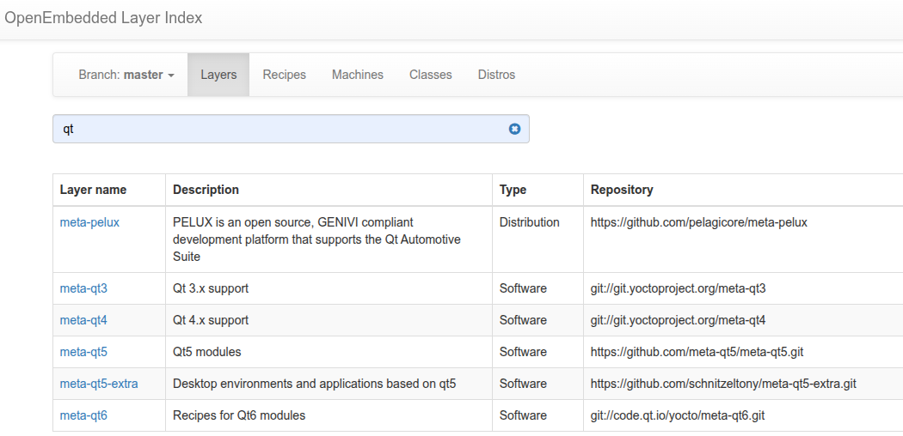

### Why Layers?
> The layer concept in Yocto is crucial for maintaining a clean, customizable, and scalable embedded Linux build system. By using layers, you can manage complexity, share configurations, and ensure that your system is flexible for multiple hardware platforms and software packages.

### How to know the layers direcories?
> the start with meta* prefix

### what is the purpose of Append to recipes files .bblayer
> specify additional steps
> highiest priority recipe takes place over the lowiest proirity

### How does a layer would look like?
> [Append to recipes - Classes - Recipe(s) - Machine(s) - Distro(s)]
> Append to recipes .bbappend: Overwrites the variables and functions that are descriped in other layers.  
> Classes .bbclass: Reuse common steps with various tasks.   
> Recipe(s) .bb: Descipes the stages of the package generation.  
> Machine(s) .conf: Descripes what machine we will be used, the uboot/kernel args, cross-compiler options and flags.  
> Distro(s) .conf: Descripes linux distro related settings.  

### How to add a layer into the build system?
> Extend the global variable **BBLAYERS** with the layer path where located at build/conf/bblayers.conf

### Show layers category?
> OpenEmbedded Core Metadata (oe-core)  
> Yocto Layer Metadata (meta-yocto)  
> Hardware specific BSP  
> UI - Optional Layer  
> Commercial Layer  
> Developers-Specific Layer  
> Remark: We modify our own layers only (Developers-Specific Layer), this is a good practice.

### How to get a recipe implemented by the community?
> openembedded layer index
> github
> example: git clone https://github.com/meta-qt5/meta-qt5.git -b kirkstone

### what is layer dependancy?
> normaly a layer dependes on other layers, and such dependancy is listed i.e /meta-qt5/conf/layer.conf
> check the variable **LAYERDEPENDS_qt5-layer = "core openembedded-layer"**, states that this layer depends on meta-layer and oe-layer, so I have to clone openembedded-layer myself as it's not existed yet in the pocy distro.  
> openembedded-layer: it's a layer group.

### How to write a layer from scratch?
> 1. Use the provided script by poky.
> 2. Copy old layer and adapt it to your implementation.

### What are dynamic layers and dynamic variables BBFILES_DYNAMIC?
> allow us to make modifications on other layers without changing their content.
