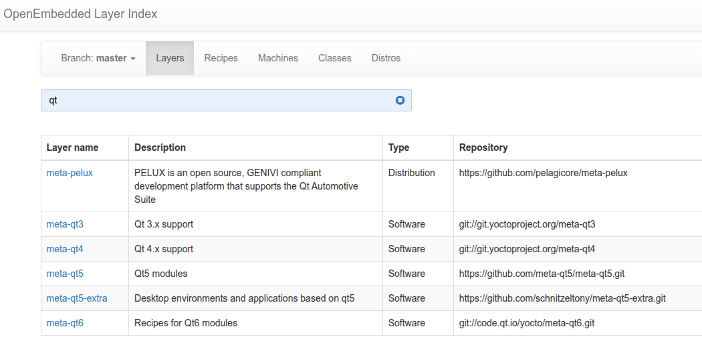

### Why Layers?
> The layer concept in Yocto is crucial for maintaining a clean, customizable, and scalable embedded Linux build system. By using layers, you can manage complexity, share configurations, and ensure that your system is flexible for multiple hardware platforms and software packages.

### How to know the layers direcories?
> the start with meta* prefix

### what is the purpose of Append to recipes files .bblayer
> specify additional steps
> highiest priority recipe takes place over the lowiest proirity

### How does a layer would look like?
> [Append to recipes - Classes - Recipe(s) - Machine(s) - Distro(s)]
> Append to recipes .bbappend: Overwrites the variables and functions that are descriped in other layers.  
> Classes .bbclass: Reuse common steps with various tasks.   
> Recipe(s) .bb: Descipes the stages of the package generation.  
> Machine(s) .conf: Descripes what machine we will be used, the uboot/kernel args, cross-compiler options and flags.  
> Distro(s) .conf: Descripes linux distro related settings.  

### How to add a layer into the build system?
> Extend the global variable **BBLAYERS** with the layer path where located at build/conf/bblayers.conf

### Show layers category?
> OpenEmbedded Core Metadata (oe-core)  
> Yocto Layer Metadata (meta-yocto)  
> Hardware specific BSP  
> UI - Optional Layer  
> Commercial Layer  
> Developers-Specific Layer  
> Remark: We modify our own layers only (Developers-Specific Layer), this is a good practice.

### How to get a recipe implemented by the community?
> openembedded layer index
> github
> example: git clone https://github.com/meta-qt5/meta-qt5.git -b kirkstone

### what is layer dependancy?
> normaly a layer dependes on other layers, and such dependancy is listed i.e /meta-qt5/conf/layer.conf
> check the variable **LAYERDEPENDS_qt5-layer = "core openembedded-layer"**, states that this layer depends on meta-layer and oe-layer, so I have to clone openembedded-layer myself as it's not existed yet in the pocy distro.  
> openembedded-layer: it's a layer group.

### How to write a layer from scratch?
> 1. Use the provided script by poky.
> 2. Copy old layer and adapt it to your implementation.

### What are dynamic layers and dynamic variables BBFILES_DYNAMIC?
> allow us to make modifications on other layers without changing their content.

### Why should we have meta-ti as long as meta-yocto-bsp contains our SoC configuration?
> 1. meta-yocto-bsp:  
> Provides "reference: BSPs for each of the supported architectures one for Arm (BeagleBone Black), one for MIPS, PPC and x86. it's based on the mainline kernel/bootloader. it doesn't support any advanced features or anything not in the upstream mainline kernel, e.e. no capes, no power management no hardware acceleration, no 3D, no PRU, etc. The purpose of this BSP is to have some basic out-of-box experience for the select hardware within poky to evaluate the YOCTO Project and OpenEmbedded framework, but not the specific harware platforms.  
> 2. meta-ti:  
> Official Texas Instruments BSP that provides the latest WIP "staging" kernel and bootloader most of the advanced features and peripjeral support for the wider range of latest TI platforms.

### How to list all the included layers by commands?
> bitbake-layers show-layers

### How to add a layer by command?
> bitbake-layers add-layer <meta-layer-path>

### How to build a minimal image?
> bitbake core-image-minimal

### How to check the packages the should be installed for your image?
> run $ bitbake -g core_image_minimal

### How to enable ssh?
> IMAGE_FEATURES:append " ssh-server-dropbear "
### How to enable UART consol?
> SERIAL_CONSOLES = "115200;ttyO0" (already defined in meta-ti-bsp)

### What are the options to change the variables of local.conf?
> 1. change it in the same file  
> 2. change it in your own layer

### List deploying steps of the BBB using wic tool?
> 1. go to: /BBB-YoctoProject/poky/build/deploy-ti/images/beaglebone/
> 2. de-compress core-image-minimal-beaglebone.wic.xz
> $ unxz core-image-minimal-beaglebone.wic.xz
> 3. partition your SD-Card and flash it with the .wic file
> sudo dd if=core-image-minimal-beaglebone.wic of=/dev/sdc status=progress bs=4096 && sync
> 4. plug the DS-Card to your BBB and boot it up
> 5. username = root, password = "NO PASSWARD REQUIRED"
> Remark: wic is a tool provided by Yocto Project, dd is a core utility tool